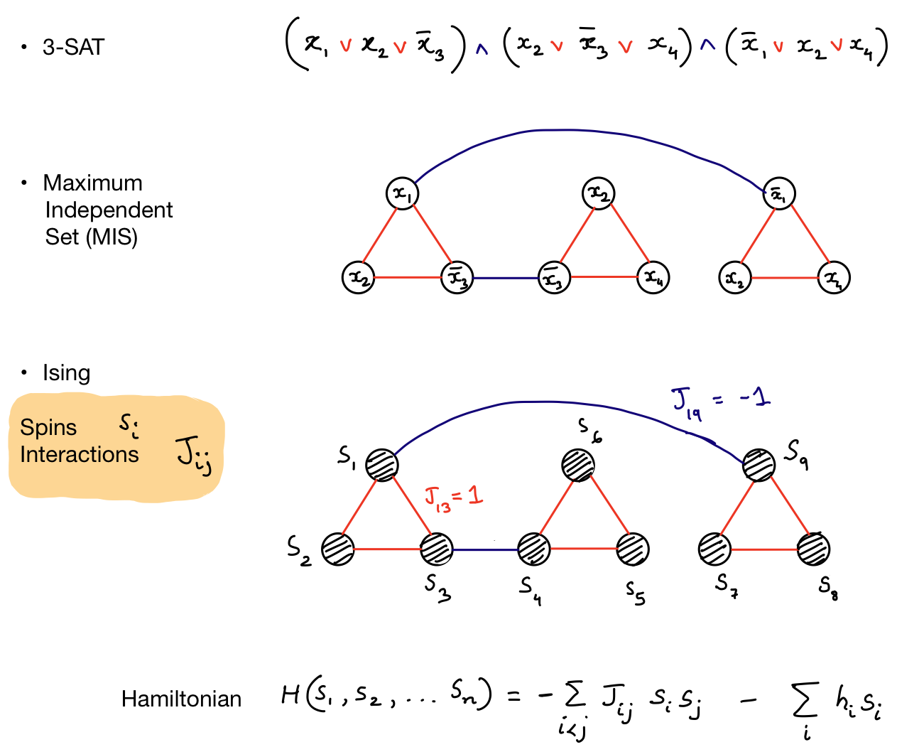

Ising formulations of many NP problems
--------------------------------------

The Ising formulation of "nondeterministic polynomial-time" (NP)-complete and NP-hard problems allows physics-based solutions to such problems by finding the ground state of a corresponding Ising spin system. In this repository, we follow Andrew Lucas' work on Ising formulations of NP-complete and NP-hard problems [https://doi.org/10.3389/fphy.2014.00005](https://doi.org/10.3389/fphy.2014.00005) and provide code to convert standard NP-hard problems such as SAT or MaxCut to Ising Hamiltonians.

Fig: 3-SAT, Maximum Indepent set and Ising formulations using binary variables ($x \in \{0, 1\}$) or spin ($s \in \{-1, 1\}$). 

3-SAT: A SAT problem in the standard conjunctive normal form (CNF) consists of binary variables (x) forming constraints called clauses. Each clause is written using OR (v) operators between three variables. The clauses are combined using AND (^) operations. The problem is solved when at least one variable within each clause can be set to 1. The 3-SAT problem is equivalent to a Maximum Independent Set (MIS) problem written using a graph of binary variables.

Maximum Independent Set: 

Ising formulation:

Contributing
------------
This repository is under development. Please feel free to contribute by opening PRs and issues. Contact me [shahnawaz.ahmed95@gmail.com](shahnawaz.ahmed95@gmail.com) for questions and discussions.
